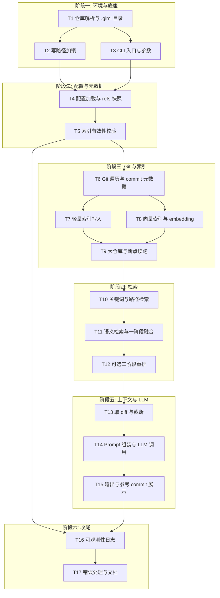

# Gimi 辅助编程 Agent 实现方案

## 1. 运行环境与目录约定

- **入口**：仅 CLI（方式一）。
- **工作目录**：必须在能查到 git 的路径下执行（与 git 行为一致：当前目录或其任意父目录为 git 仓库）。启动时用 `git rev-parse --show-toplevel` 解析**仓库根**；若失败则报错退出并提示在 git 仓库内执行。
- **生成文件**：全部放在**仓库根**下的 `**.gimi/`** 目录（方案 A），包含索引、配置、日志等，不向项目其他位置写入。

## 2. `.gimi/` 目录结构建议

```
<repo_root>/.gimi/
├── config.json          # 持久化配置（API、模型、检索参数等）
├── index/               # 轻量索引（commit meta + 路径等，便于关键词/路径检索）
├── vectors/             # 向量索引（语义检索用，如 SQLite+embedding 或独立向量库文件）
├── cache/               # 可选：commit diff 缓存，避免重复 git show
└── logs/                # 运行日志、错误日志
```

具体文件名与格式在实现阶段定（例如 index 用 SQLite 或 JSON，由技术选型决定）。

## 3. 核心流程（与前述讨论一致）

1. **解析运行环境**：解析 repo root，确认 `.gimi` 路径；解析 CLI 参数（用户需求、可选 `--file`、`--branch`）。
2. **Git 与索引**：若需建/更新索引，则从 repo root 读取各分支 commit（message、改动文件、diff 或摘要），写入轻量索引与向量索引，均落在 `.gimi/index` 与 `.gimi/vectors`。
3. **混合检索**：关键词 + 路径 + 语义检索，融合得到 Top-K commit（仅用索引，不在此步读大段 diff）。
4. **组上下文**：仅对 Top-K 的 commit 取 diff（可截断），拼成 LLM 上下文。
5. **调用 LLM**：上下文 + 用户需求 → 生成建议；结果输出到终端，并可注明参考的 commit。
6. **日志**：关键步骤与错误写入 `.gimi/logs/`。

## 4. 技术要点摘要

- **索引策略**：轻量索引存 message、分支、改动路径、可选摘要；向量索引对「message + 路径/摘要」做 embedding，用于语义检索。
- **上下文控制**：只对检索得到的 Top-K commit 取 diff，并按文件/行数做截断，避免占满 LLM 上下文。
- **配置**：API key、模型名、K、截断规则等可存于 `.gimi/config.json`，首次运行可交互生成或带默认值。

### 4.1 索引与向量粒度

- **轻量索引**：以 **commit** 为单位存储。每条：commit hash、message、分支、改动文件路径列表、时间；可选存一句简短摘要（规则提取或占位）。
- **向量索引**：以 **commit** 为单位。单条 embedding 的输入 =「message + 改动文件路径列表（拼接或摘要）」；与轻量索引一一对应，便于检索后取 diff。若后续发现单 commit 改动过多、语义混杂，再考虑增加「单文件单 commit」副索引。

### 4.2 融合与重排序

- **一阶段融合**：先用关键词（BM25 或 term 匹配）与路径（精确/前缀匹配）在轻量索引上筛出**候选集**（如 50～100 条 commit）；再在该候选集上用向量相似度排序，取 **Top-K**（如 15～25）进入上下文。
- **可选二阶段重排**：对 Top-K 用小型 cross-encoder 或 LLM 做相关性打分，再取 Top-5～10 的 diff 作为最终送入 LLM 的上下文，在质量与 token 占用之间做权衡；实现时可作为配置开关。

## 5. 架构约束

### 5.1 索引有效性策略

- 在 `.gimi` 内持久化「当前索引对应的 git 状态」：例如各分支当前 HEAD 的 commit hash 或 `refs` 快照（具体格式实现时定）。
- 每次 CLI 启动后、使用索引前：比对当前仓库的 refs 与所存快照；若不一致则视索引过期，提示用户重建或自动触发增量更新（只处理新增 commit）。
- 保证「在能查到 git 的路径下执行」时，使用的索引与当前历史一致。

### 5.2 写路径加锁

- 对 `.gimi/index`、`.gimi/vectors`、`.gimi/cache` 的写入使用**文件锁**（如 fcntl 或单进程 PID 文件）。
- 若检测到已有其他 `gimi` 进程正在写入，当前进程报错退出或阻塞等待，避免并发写导致索引损坏。

### 5.3 大仓库策略

- **可配置上限**：支持配置「只索引最近 N 个 commit」或「某时间之后的 commit」或「仅指定分支（如 default + 当前分支）」以控制索引规模。
- **断点续跑**：首次全量索引按 commit 分批处理，每批写一次索引；失败或中断后可从上一批继续，无需从头全量重跑。

### 5.4 可观测性

- 每次请求在日志中记录：**request id**、**repo root**、**索引是否复用**（或已触发重建/增量）、**候选集大小与最终 Top-K 数量**、**送入上下文的 diff 规模**（如估算 token 或行数）、**LLM 调用耗时**。
- 便于排查「为什么没搜到」「为什么慢」以及复现问题。

---

## 7. 任务拆解与理由

整体按「可独立验证、依赖清晰、风险隔离」拆成阶段与子任务；同一阶段内子任务尽量可并行或短依赖。




### 阶段一：环境与底座


| 任务                    | 内容                                                                                                                      | 拆解理由                                                                  |
| --------------------- | ----------------------------------------------------------------------------------------------------------------------- | --------------------------------------------------------------------- |
| **T1 仓库解析与 .gimi 目录** | 用 `git rev-parse --show-toplevel` 解析 repo root；若失败则报错退出；创建/确认 `.gimi` 及子目录（index、vectors、cache、logs）；不写业务数据，只做路径与目录存在性。 | 所有后续逻辑都依赖「当前在哪个 repo、数据写哪里」；单独成任务便于在无索引、无锁的情况下验证「在子目录执行也能正确找到根」和目录结构。 |
| **T2 写路径加锁**          | 实现针对 `.gimi` 下写入操作的锁（如 PID 文件或 fcntl）；获取锁失败时退出或等待；在 T1 提供的路径上工作。                                                        | 与业务无关，纯基础设施；先于任何索引写入实现，避免后续并发写导致损坏；可单独做单元测试或双进程测试。                    |
| **T3 CLI 入口与参数**      | 解析子命令/位置参数（用户需求）、`--file`、`--branch`；校验必填项；将解析结果交给后续流程占位（暂不实现检索与 LLM）。                                                  | 明确「用户能传什么、怎么传」；与 repo 解析、锁、索引解耦，便于先跑通「输入 → 占位输出」的骨架。                  |


**阶段完成标准**：在任意 git 子目录执行 CLI，能解析到 repo root、创建 `.gimi`、加锁成功，并正确解析并打印/占位使用 `--file`、`--branch` 与需求文本。

---

### 阶段二：配置与元数据


| 任务                   | 内容                                                                                                                   | 拆解理由                                                                          |
| -------------------- | -------------------------------------------------------------------------------------------------------------------- | ----------------------------------------------------------------------------- |
| **T4 配置加载与 refs 快照** | 从 `.gimi/config.json` 读取非敏感配置（模型、K、截断规则、大仓库上限等）；定义并持久化「refs 快照」格式（如各分支 HEAD hash）；在索引构建/更新完成后写快照；首次运行无配置时使用默认值或引导生成。 | 配置与索引元数据是后续「是否重建索引」「检索参数」的唯一来源；refs 快照是索引有效性的依据，与「读 git」解耦，便于先定格式再在 T5/T6 使用。 |
| **T5 索引有效性校验**       | 启动时读取当前仓库 refs，与 `.gimi` 内 refs 快照比对；若不一致则标记索引过期并决定：提示用户重建或自动触发增量/全量（触发逻辑可先简化为「需要重建」标志，由后续索引任务消费）。                   | 独立于「如何建索引」，只做「要不要用现有索引」的判断；先实现可避免后续在「有索引但已过期」状态下误用旧数据。                        |


**阶段完成标准**：能正确加载/写入 config 与 refs 快照；在手动修改 refs（如 commit 一次）后再次运行能检测到过期并置位「需重建」。

---

### 阶段三：Git 与索引


| 任务                        | 内容                                                                                                                | 拆解理由                                                            |
| ------------------------- | ----------------------------------------------------------------------------------------------------------------- | --------------------------------------------------------------- |
| **T6 Git 遍历与 commit 元数据** | 从 repo root 遍历指定分支的 commit，产出结构化数据：hash、message、分支、改动文件路径列表、时间；不在此步拉取完整 diff，只做元数据；受 T4 大仓库配置约束（N 条/时间/分支）。       | 与「存到哪里」「如何检索」解耦；先保证「能稳定、可控地枚举 commit」再考虑存储格式与检索，便于在不同仓库上测性能和边界。 |
| **T7 轻量索引写入**             | 将 T6 产出的 commit 元数据写入 `.gimi/index`（如 SQLite 或 JSON），支持按 message、路径、分支、时间查询；与 T2 锁配合，写入前加锁。                       | 轻量索引是关键词与路径检索的唯一数据源；与向量索引分离可先实现「关键词+路径」检索（T10）而不依赖 embedding。   |
| **T8 向量索引与 embedding**    | 对每个 commit 用「message + 路径列表」生成 embedding，写入 `.gimi/vectors`；与轻量索引通过 commit hash 关联；选用本地或远程 embedding 模型/API 由实现定。 | 语义检索依赖此索引；单独成任务便于选型（向量库、模型）和评估 embedding 质量，不影响 T6/T7 的稳定性。     |
| **T9 大仓库策略与断点续跑**         | 在 T6 上增加分批遍历（如每批 M 个 commit）；每批完成后将进度与已写入的索引状态持久化；启动时若发现未完成的全量任务则从上一批继续；可配置 N/时间/分支上限。                            | 大仓库与断点续跑是「索引构建」的增强，不改变「单批 commit → 写入」的接口；独立实现便于测试中断恢复与上限生效。    |


**阶段完成标准**：对测试仓库能完整跑通「遍历 → 写轻量索引 + 写向量索引」；中断后能续跑；refs 快照在索引完成后更新。

---

### 阶段四：检索


| 任务                 | 内容                                                                                                | 拆解理由                                                                              |
| ------------------ | ------------------------------------------------------------------------------------------------- | --------------------------------------------------------------------------------- |
| **T10 关键词与路径检索**   | 在轻量索引上实现：基于用户需求文本的关键词匹配（如 BM25 或 term）、基于 `--file` 的路径精确/前缀匹配；输出候选 commit 列表（如 50～100），不在此步做向量检索。 | 仅依赖轻量索引与 CLI 参数，不依赖 LLM/embedding；先实现可验证「路径+关键词」是否足够筛掉大量无关 commit，并为 T11 提供稳定候选集。 |
| **T11 语义检索与一阶段融合** | 对 T10 的候选集用向量相似度排序，取 Top-K；实现融合策略（如加权或 RRF）；输出最终 Top-K 的 commit hash 列表。                          | 完成「关键词+路径 → 候选 → 向量排序 → Top-K」的闭环；一阶段融合是主路径，二阶段重排可选，故先实现并稳定。                      |
| **T12 可选二阶段重排**    | 对 Top-K 用 cross-encoder 或 LLM 做相关性打分，再取 Top-5～10；通过配置开关启用/关闭。                                     | 与主路径解耦，关闭时不影响 T11 行为；单独实现便于做 A/B 或性能对比。                                           |


**阶段完成标准**：给定需求与 `--file`，能复现「候选集 → Top-K」的数值结果；开启二阶段时 Top-K 被进一步压缩为更少条且可配置。

---

### 阶段五：上下文与 LLM


| 任务                        | 内容                                                                                                      | 拆解理由                                                        |
| ------------------------- | ------------------------------------------------------------------------------------------------------- | ----------------------------------------------------------- |
| **T13 取 diff 与截断**        | 对 Top-K 的每个 commit 执行 `git show`（或读 cache）；按配置做截断（每文件行数、每 commit 文件数）；输出结构化「commit + 截断后 diff」供 T14 使用。 | 不涉及 prompt 与 LLM，只做「按 hash 取内容 + 截断」；可单独测试 token/行数上限与缓存命中。 |
| **T14 Prompt 组装与 LLM 调用** | 定义 system/user 消息结构，将用户需求与 T13 的 diff 列表拼成 prompt；调用配置中的 LLM API；解析响应为「建议文本」及可选的引用 commit。              | 核心 AI 交互；与「如何取 diff」「如何展示」解耦，便于单独调 prompt 与模型。              |
| **T15 输出与参考 commit 展示**   | 将 T14 的建议输出到终端；可选列出参考的 commit hash/message；格式可读（如 Markdown 或纯文本）。                                       | 纯展示层，不改变检索与生成逻辑；便于先定输出格式再迭代 prompt。                         |


**阶段完成标准**：端到端能「用户需求 → Top-K → diff → LLM → 终端输出建议与参考 commit」。

---

### 阶段六：收尾


| 任务              | 内容                                                                                                         | 拆解理由                                              |
| --------------- | ---------------------------------------------------------------------------------------------------------- | ------------------------------------------------- |
| **T16 可观测性日志**  | 在关键步骤写入 `.gimi/logs`：request id、repo root、索引是否复用、候选集大小、Top-K 数量、上下文规模、LLM 耗时；与 T5（索引有效性）和 T14（LLM）等已有逻辑挂接。 | 不改变主流程语义，只增加日志；集中实现便于统一格式与轮转策略，避免在多个任务里散落 log 调用。 |
| **T17 错误处理与文档** | 统一处理「非 git 目录」「锁失败」「索引损坏」「LLM 超时/限流」等错误并给出明确提示；编写 README/使用说明（运行条件、参数、配置项、.gimi 含义）。                       | 提升可用性与可维护性；放在最后可在「主流程已跑通」的基础上收敛所有异常分支与对外说明。       |


**阶段完成标准**：一次完整请求在 logs 中可追溯；常见错误有清晰提示；新用户能按文档完成首次运行与配置。

---

### 依赖与并行小结

- **T1→T2→T4**：环境与锁是配置与 refs 的前提。
- **T1→T3**：CLI 与 repo 解析可并行开发，但都依赖 T1 的路径约定。
- **T4→T5**：refs 快照格式由 T4 定，T5 只读并比对。
- **T5→T6**：索引有效性决定「是否跑 T6～T9」。
- **T6→T7、T6→T8**：T7 与 T8 可并行，都消费 T6 的 commit 流。
- **T7&T8→T9**：大仓库与断点续跑包装同一套写入流程。
- **T9→T10→T11→T12**：检索链顺序执行；T12 可选。
- **T12→T13→T14→T15**：上下文与 LLM 链顺序执行。
- **T5、T15 后接 T16**：日志可随索引与请求两处挂接；T16 后再做 T17 收尾。

按上述顺序推进，可每阶段交付可验证结果，并控制单次改动范围与回滚成本。

---

